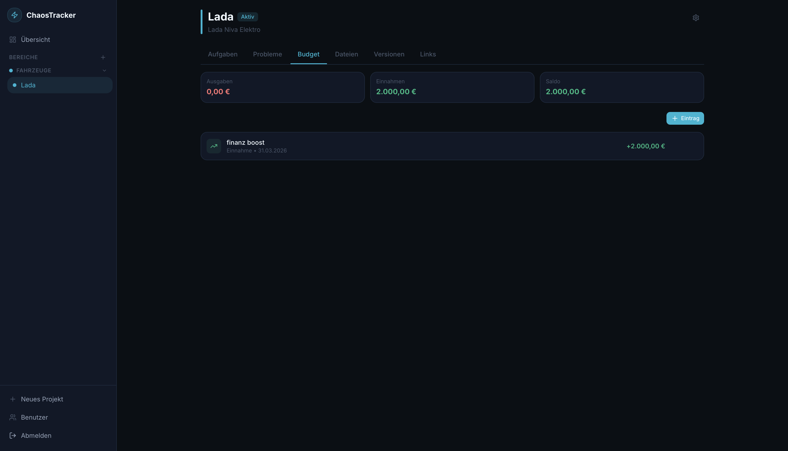

# ChaosTracker is in Alpha

Selbst gehostete Projektverwaltung — dark, modern, simpel, PWA-fähig.



---

## Features

- **Bereiche** — Projekte nach Themen gruppieren (z. B. Elektronik, Fahrzeuge)
- **Aufgaben** — To-dos mit Status, Priorität und Fälligkeitsdatum
- **Probleme** — Bug/Issue-Tracking mit Schweregrad
- **Budget** — Ausgaben und Einnahmen pro Projekt (rollenbasiert)
- **Dateien** — Datei-Upload direkt ins Projekt
- **Links** — Wichtige URLs, Datenblätter, Repos
- **Versionen** — SW/HW/Firmware-Versionsverfolgung
- **Mehrbenutzer** — Login mit Rollen: Admin, Management, Benutzer
- **PWA** — Auf dem Handy installierbar (Android & iOS)
- **Mobile-first** — Bottom-Navigation, Bottom-Sheets, optimiert für Touch

---

## Tech Stack

| Bereich | Technologie |
|---|---|
| Framework | Next.js 14 (App Router, TypeScript) |
| Styling | Tailwind CSS v3 |
| Datenbank | SQLite via Prisma ORM |
| Auth | JWT (jose) + bcrypt |
| Deployment | Docker / Docker Compose |

---

## Rollen

| Rolle | Beschreibung |
|---|---|
| **Admin** | Voller Zugriff, Benutzerverwaltung |
| **Management** | Projekte erstellen, Zugriffsrechte pro Projekt vergeben, Budget einsehen |
| **Benutzer** | Zugriff nur auf freigegebene Projekte, kann Ausgaben eintragen |

---

## Erstinstallation (Docker)

**Voraussetzungen:**
- Docker + Docker Compose

```bash
# 1. Repository klonen
git clone https://github.com/Obili69/chaosViewer.git
cd chaosViewer

# 2. Umgebungsvariablen konfigurieren
cp .env.example .env
# .env öffnen und JWT_SECRET, ADMIN_USERNAME, ADMIN_PASSWORD setzen
```

`.env` bearbeiten:

```env
JWT_SECRET=<langer_zufälliger_string>   # openssl rand -hex 64
ADMIN_USERNAME=admin
ADMIN_PASSWORD=meinPasswort
```

```bash
# 3. Container bauen und starten
docker compose up -d
```

Die App ist erreichbar unter: **http://localhost:3039**

> **Hinweis:** `ADMIN_USERNAME` und `ADMIN_PASSWORD` werden beim ersten Start verwendet, um den Admin-Account zu erstellen. Danach können diese aus der `.env` entfernt werden — der Account bleibt in der Datenbank erhalten.

---

## Update

```bash
cd /pfad/zu/chaosViewer
chmod +x update.sh   # einmalig
./update.sh
```

Das Skript führt automatisch aus:
- `git pull origin main`
- `docker compose build`
- `docker compose up -d`

Datenbank-Schemaänderungen werden beim Container-Start automatisch angewendet.

---

## Datenspeicherung

```
chaosViewer/
├── data/       # SQLite-Datenbank (chaosviewer.db) — NICHT ins Git!
├── uploads/    # Hochgeladene Dateien — NICHT ins Git!
└── .env        # Konfiguration — NICHT ins Git!
```

**Backup:** `data/` und `uploads/` sichern genügt für ein vollständiges Backup.

---

## Konfiguration (.env)

| Variable | Beschreibung | Standard |
|---|---|---|
| `JWT_SECRET` | Zufälliger Secret für JWT-Tokens | — |
| `ADMIN_USERNAME` | Admin-Benutzername (nur erster Start) | — |
| `ADMIN_PASSWORD` | Admin-Passwort (nur erster Start) | — |

Database URL und Upload-Pfad sind in `docker-compose.yml` fest konfiguriert und müssen nicht in `.env` gesetzt werden.

---

## Manuelle Docker-Befehle

```bash
# Status prüfen
docker compose ps

# Logs anzeigen
docker compose logs -f

# Container neu starten
docker compose restart

# Stoppen
docker compose down

# Image neu bauen (nach Code-Änderungen)
docker compose build
docker compose up -d
```

---

## PWA-Installation

### Android (Chrome)
1. App im Browser öffnen
2. Menü → **„Zum Startbildschirm hinzufügen"**

### iOS (Safari)
1. App in Safari öffnen
2. Teilen-Symbol → **„Zum Home-Bildschirm"**

---

## Entwicklung (lokal)

```bash
git clone https://github.com/Obili69/chaosViewer.git
cd chaosViewer
cp .env.example .env
# .env anpassen: DATABASE_URL=file:./data/chaosviewer.db, JWT_SECRET setzen
npm install
npx prisma db push
node scripts/create-admin.js admin geheim
npm run dev
```

Öffne `http://localhost:3039`
